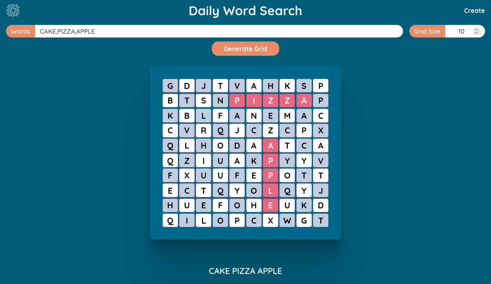

# Daily Word Search

This project lets you design your own word search puzzles. Simply input your list of words and desired grid size, and the system will create a puzzle grid with your words hidden among random letters.

## Screenshot



## Tech Stack

**Client:** HTML, CSS, JavaScript  
**Server:** Java, Spring Boot  
**Deployment:** Docker, Render.com, Vercel

## Lessons Learned

- Learned to design and implement a simple REST API using Spring Boot for efficient backend communication
- Gained experience in containerizing the application with Docker and deploying it on [Render](https://render.com)
- Successfully deployed the frontend on [Vercel](https://vercel.com) for fast and efficient hosting

## Demo

You can find the working demo [here](https://wordsearch-puzzle.vercel.app/).

## Features

- Generate puzzles instantly based on the words and grid size provided
- Puzzles can be easily printed for offline solving
- Ideal for teachers and students to create engaging vocabulary and spelling activities

## Run Locally

Clone the project and make sure Node.js and Java are installed on your system:

```bash
  git clone https://github.com/HashHazard/wordsearch-puzzle.git
```

Go to the project directory:

```bash
  cd wordsearch-puzzle
```

Install dependencies for the frontend:

```bash
  cd client
  npm install
```

Edit the `index.js` file located at `wordsearch-puzzle/client/js/index.js` and comment line 34 and uncomment line 33. The end result should look like this:

```javascript
  // other code

  try {
    let response = await fetch(
      `http://localhost:8080/wordgrid?gridsize=${gridsize}&wordlist=${commaseperatedwords}`
      // `https://wordsearch-springboot.onrender.com/wordgrid?gridsize=${gridsize}&wordlist=${commaseperatedwords}`
    );
    response = await response.text();

  // other code
```

Start the frontend server. It will probably be on http://localhost:5173/:

```bash
  cd wordsearch-puzzle/client
  npx vite dev
```

For the backend server, find the `WordSearchController.java` file located at `backend/src/main/java/com/hashhazard/wordsearchapi/controllers` and comment line 18 and uncomment line 19. The end result should look like this:

```java
  // other code

  @RequestMapping("/")
  //@CrossOrigin(origins = "https://wordsearch-puzzle.vercel.app")
  @CrossOrigin(origins = "*")

  // other code
```

Start the backend server. It will be located at http://localhost:8080:

```bash
  cd wordsearch-puzzle/backend
  ./gradlew bootRun
```

## API Reference

#### Create Word Grid

```http
GET /wordgrid?gridSize=${int}&wordList=${string}
```

| Parameter  | Type     | Description                                 |
| :--------- | :------- | :------------------------------------------ |
| `gridSize` | `int`    | **Required**. The size of the grid          |
| `wordList` | `string` | **Required**. Comma-separated list of words |

- **gridSize**: Size of the grid (e.g., 10 for a 10x10 grid).
- **wordList**: Comma-separated words to include (e.g., "DOG,CAT"). Defaults to "BUG,WRATH,ERROR,POODLE" if empty.

This endpoint generates a word search puzzle grid with the specified size and words. The response is a string representation of the grid.

## Roadmap

- Move from Docker Hub to GitHub for deploying Docker image
- Add categories of predefined words
- Add multiplayer support

## License

[MIT](./LICENSE)
